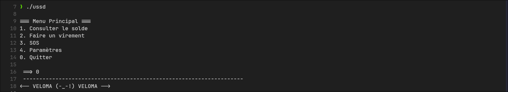
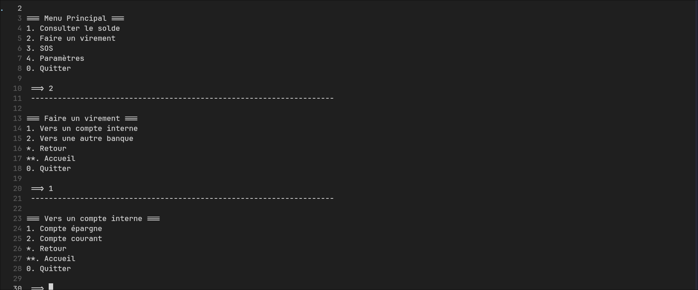

# Project generated with [Templi](https://github.com/RickaPrincy/Templi)

# USSD emulator

Simulate your USSD






# Usage

```cpp
#include "static_options.hpp"

#include <iostream>
#include "option.hpp"
#include "special.hpp"

namespace ussd {

    #define MSG(text) [&is_running] { std::cout << "Succès : " << text << "\n"; is_running = false; }

    static auto create_consulter_solde_option(Option *&current, bool &is_running) -> Option * {
        return new Option("1", "Consulter le solde", {
            new Option("1", "Votre solde est de 1234,56 EUR", MSG("Votre solde est de 1234,56 EUR")),
            SpecialOption::back(current),
            SpecialOption::root(current),
            SpecialOption::exit(is_running)
        });
    }

    static auto create_virement_option(Option *&current, bool &is_running) -> Option * {
        return new Option("2", "Faire un virement", {
            new Option("1", "Vers un compte interne", {
                new Option("1", "Compte épargne", MSG("Virement vers compte épargne")),
                new Option("2", "Compte courant", MSG("Virement vers compte courant")),
                SpecialOption::back(current),
                SpecialOption::root(current),
                SpecialOption::exit(is_running)
            }),
            new Option("2", "Vers une autre banque", {
                new Option("1", "Virement SEPA", MSG("Virement SEPA effectué")),
                new Option("2", "Virement SWIFT", MSG("Virement SWIFT effectué")),
                SpecialOption::back(current),
                SpecialOption::root(current),
                SpecialOption::exit(is_running)
            }),
            SpecialOption::back(current),
            SpecialOption::root(current),
            SpecialOption::exit(is_running)
        });
    }

    static auto create_parametres_option(Option *&current, bool &is_running) -> Option * {
        return new Option("4", "Paramètres", {
            new Option("1", "Changer la langue", MSG("Langue modifiée")),
            new Option("2", "Modifier le code PIN", MSG("Code PIN modifié")),
            SpecialOption::back(current),
            SpecialOption::root(current),
            SpecialOption::exit(is_running)
        });
    }

    static auto create_sos_option(Option *&current, bool &is_running) -> Option * {
        return new Option("3", "SOS", {
            new Option("1", "Message SOS", MSG("Message SOS envoyé")),
            SpecialOption::back(current),
            SpecialOption::root(current),
            SpecialOption::exit(is_running)
        });
    }

    auto create_root_menu(Option *&current, bool &is_running) -> Option {
        return Option("_", "Menu Principal", {
            create_consulter_solde_option(current, is_running),
            create_virement_option(current, is_running),
            create_sos_option(current, is_running),
            create_parametres_option(current, is_running),
            SpecialOption::exit(is_running)
        });
    }

}  // namespace ussd
```
